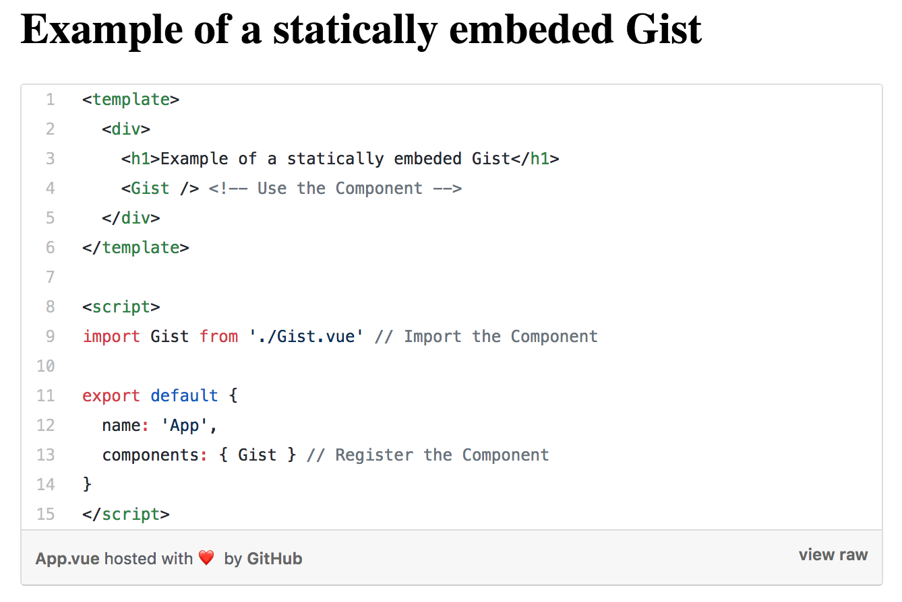

# Vue Static Gist Example

This is an example showing how to embed a Gist statically as a Vue Component that
supplements my blog post at https://medium.com/@nickwu241/embed-a-gist-statically-in-vue-4df59b56b29.



## Deploying

The website is hosted by GitHub Pages using the `docs` folder.

```shell
rm -rf docs && parcel build -d docs --public-url ./ --no-minify index.html
```
